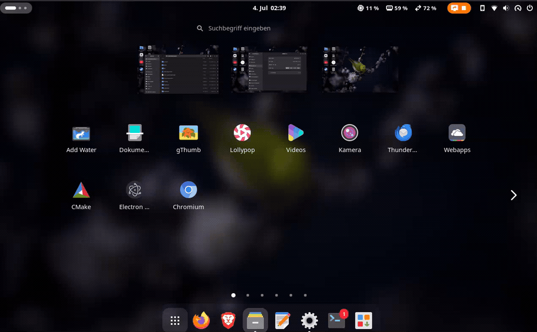

# Mission WS

[](https://github.com/Gerry3010/mission-ws/actions/workflows/ci.yml)

Reorder GNOME workspaces by **drag & drop**, right from the overview thumbnail
strip — with Mac-Mission-Control-style circular hover buttons.



When you hover a workspace preview, two circles appear centred on its top
corners (they overhang the edge, like macOS):

- **top-left — reorder handle:** grab it and drag the workspace to a new
  position in the strip.
- **top-right — close:** removes that workspace.

Clicking the preview itself still activates the workspace (native behaviour is
untouched). The circles only disappear once the pointer leaves the preview
**plus the circle radius**, so they don't flicker away at the edge.

The same handle + close circles also appear on the larger workspace tiles in
the app-grid ("Launchpad") view:


## Requirements

- GNOME Shell **48 – 50** (developed and tested on 50.1, Wayland).

## Install

### From source (development)

```sh
make install     # copy into ~/.local/share/gnome-shell/extensions
# log out / back in (Wayland) or restart the shell (Xorg: Alt+F2, r)
make enable
```

Or symlink instead of copy while hacking: `make install-link`.

### Try it without touching your session (nested shell, Wayland-safe)

```sh
make test        # launches a throwaway `gnome-shell --nested` with it enabled
```

Open the overview (**Super**) inside the nested window and hover a workspace
thumbnail.

## How it works

Rather than adding a separate popup, Mission WS patches the shell's native
`ThumbnailsBox` / `WorkspaceThumbnail` (`workspaceThumbnail.js`) with an
`InjectionManager`:

- `addThumbnails` is wrapped to decorate each thumbnail with the two circles
  (`decorator.js`).
- `handleDragOver` / `acceptDrop` are wrapped to recognise a reorder drag from
  the handle and call `global.workspace_manager.reorder_workspace()`. The
  native window-onto-workspace drop keeps working for any other drag source.

All patches are reverted and every actor/timer/handler is torn down in
`disable()`.

## Notes

- Works with both static and dynamic workspaces. With dynamic workspaces GNOME
  auto-manages the trailing empty workspace, so *close* is most useful with
  static workspaces (`org.gnome.mutter dynamic-workspaces false`).
- The last remaining workspace is never closed.

## License

MIT © Gerald Hofbauer
